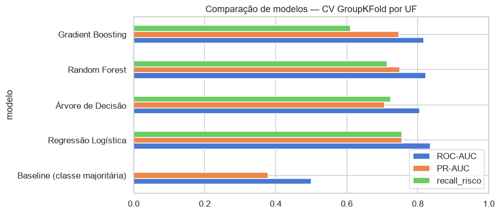
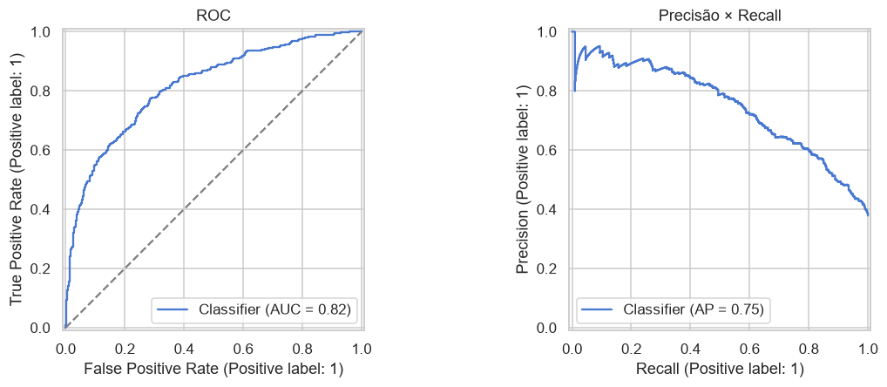
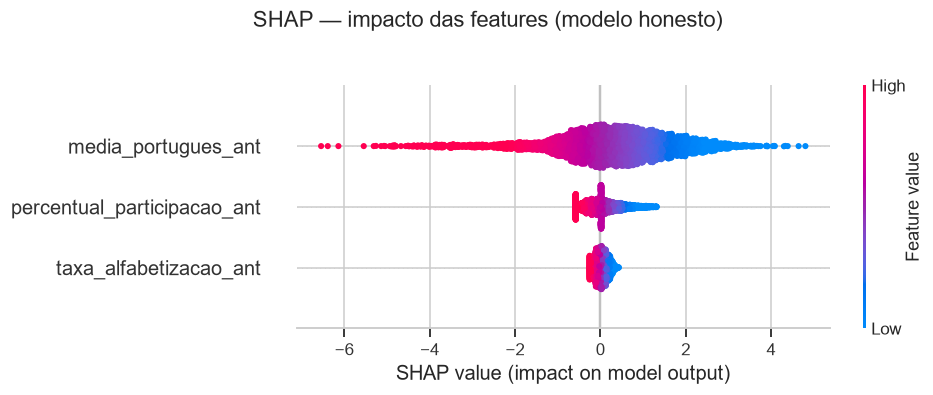
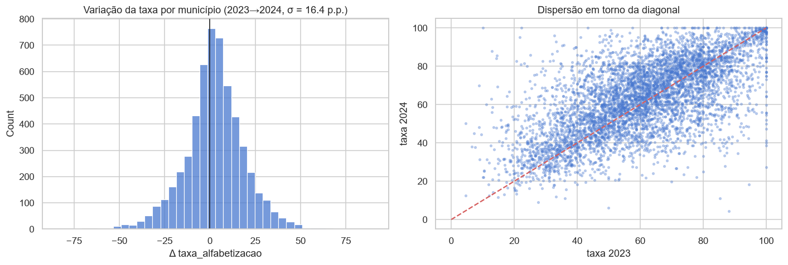
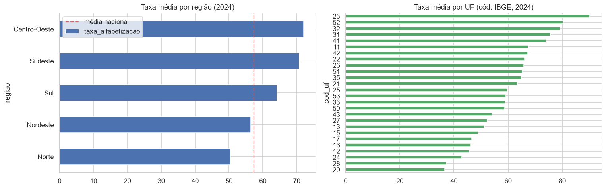
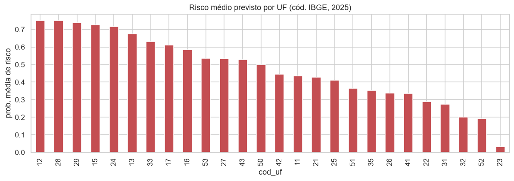
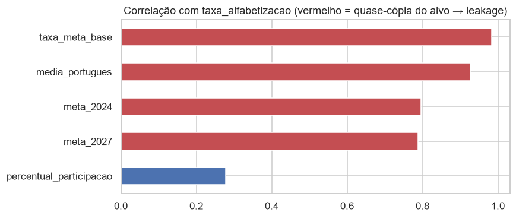

# 🎓 Predição de Risco Educacional em Alfabetização no Brasil

> **Tech Challenge – Fase 3 | PosTech FIAP**

Modelo supervisionado que, a partir de dados do ano anterior, identifica
municípios brasileiros **em risco educacional** — abaixo do nível médio nacional
de alfabetização — para apoiar a priorização de políticas públicas.

## 👥 Equipe

| Integrante | RM | |
|---|---|---|
| Gabriela de Lima Lopes | RM372467 | LinkedIn |
| Vitor Lopes Rodrigues | RM372427 | LinkedIn |
| Lucas Oliveira dos Santos Lima | RM372651 | LinkedIn |
| Mateus Quintino Vieira dos Santos | RM371795 | LinkedIn |

---

## 📌 Contexto do Problema

O **Compromisso Nacional Criança Alfabetizada (CNCA)** define metas anuais de
alfabetização por município, aferidas pelo SAEB/INEP (2º ano do ensino
fundamental), com o objetivo de **80% das crianças alfabetizadas até 2030**.

Um gestor público só consegue agir a tempo — realocar FUNDEB, priorizar formação
de professores, PDDE, busca ativa — se souber **antes do próximo ciclo de prova**
quais municípios estão em risco. É esse o problema que o projeto ataca:
**antecipar o risco educacional usando apenas informação já disponível.**

## 🎯 Objetivo Analítico

Classificação binária de **(município, ano)**: prever se um município tende a
ficar **em risco educacional** no ano seguinte, usando somente features do ano
anterior (sem *data leakage*).

> **Nota metodológica.** Os dados públicos do INEP/SAEB são **agregados por
> município/UF/ano** — não há microdado por aluno. A unidade do modelo é
> (município, ano), e o alvo "aluno alfabetizado/não" foi reformulado para um
> indicador municipal (ver *Target* abaixo), mantendo o espírito da pergunta:
> identificar quem está em risco.

## 📊 Base de Dados

Fonte: **camada Gold da pipeline da Fase 2** (dados INEP/SAEB já tratados),
armazenada em `s3://tech-challenge-fase2-fiap-vitor/layers/gold` e consumida por
`src/preprocessing/gold_consumer.py` (com cache local em `data/gold/`).

| Dataset (Gold) | Granularidade | Uso no projeto |
|---|---|---|
| `indicador_municipio` | município-ano | base de modelagem (`taxa_alfabetizacao`, `media_portugues`, `percentual_participacao`, metas) |
| `painel_nacional` | Brasil-ano | referência nacional (`taxa_media_nacional`) usada como corte do target |
| `ranking_uf`, `meta_vs_realizado_uf`, `evolucao_uf` | UF-ano | contexto / EDA |

Enriquecimento externo: **IBGE** (`data/raw/municipios_ibge.csv`) para nomes de
municípios, UF e região.

- **Anos disponíveis: 2023 e 2024.**
- **Unidade:** (município, ano), 1 linha por chave (~5.500 municípios/ano).

## 🎯 Target

**Principal (modelo entregue):**

```
em_risco = (taxa_alfabetizacao < taxa_media_nacional[ano])
```

Classe positiva = município abaixo do nível médio do país (prevalência ~38%).
Escolhido porque o **nível** de alfabetização é fortemente autocorrelacionado
ano a ano — logo, previsível a partir do ano anterior.

**Secundário (investigado, reportado como achado):** `taxa < meta_ano_vigente`
("não bater a meta anual"). Mostrou-se **quase imprevisível** (ROC-AUC ≈ 0,60):
a taxa municipal oscila ±16 p.p./ano e a meta é fixada só ~1,4 p.p. acima da
taxa anterior, então cruzar a meta num ano é dominado por ruído. Isso é um
resultado honesto do projeto — ver `notebooks/03b`, seção 7.

## 🔄 Etapas de Modelagem

| Etapa | Onde |
|---|---|
| 1. Consumo da Gold (S3 → cache local) | `src/preprocessing/gold_consumer.py`, `notebooks/01` |
| 2. EDA — distribuições, volatilidade, correlações, recorte regional, hipóteses | `notebooks/02_eda.ipynb` |
| 3. Diagnóstico de *data leakage* | `notebooks/03a_diagnostico_vazamento_dados.ipynb` |
| 4. Features defasadas + target + validação de schema | `src/preprocessing/features.py` |
| 5. Pipeline de ML (pré-processamento + modelo, `fit` só no treino) | `src/modeling/pipeline_modelo_d.py` |
| 6. Baseline + comparação de modelos + interpretabilidade + negócio | `notebooks/03b_modelo_defasagem_temporal.ipynb` |
| 7. Previsão de risco (ranking) | `src/modeling/prever_proximo_ano.py` |
| — Apêndice: modelo com *leakage* (contraexemplo inválido) | `notebooks/03_modelo_A_contraexemplo.ipynb` |

## 🤖 Escolha do Algoritmo

Comparados na mesma pipeline / mesma CV (`GroupKFold` por UF):

| Modelo | ROC-AUC | PR-AUC | Recall (risco) |
|---|---|---|---|
| Baseline (classe majoritária) | 0,50 | 0,38 | 0,00 |
| **Regressão Logística** ✅ | **0,84** | **0,76** | **0,76** |
| Árvore de Decisão | 0,81 | 0,71 | 0,72 |
| Random Forest | 0,82 | 0,75 | 0,71 |
| Gradient Boosting | 0,82 | 0,75 | 0,61 |



**Regressão Logística** foi escolhida: com 3 features e sinal quase linear, tem o
melhor ROC-AUC / PR-AUC e o **melhor recall da classe de risco** (métrica
prioritária — não deixar município em risco passar batido), além de ser
interpretável. Pré-processamento: `SimpleImputer(mediana)` + `StandardScaler`
dentro de um `ColumnTransformer` + `Pipeline`; `class_weight="balanced"`.

**Features (todas do ano anterior):** `taxa_alfabetizacao_ant`,
`media_portugues_ant`, `percentual_participacao_ant`.

## 📈 Métricas de Avaliação

Classe positiva = "em risco" (minoritária) → priorizamos **recall da classe de
risco** e **PR-AUC**; accuracy é sempre reportada ao lado do baseline.

| Métrica | Holdout (municípios) | CV `GroupKFold`/UF |
|---|---|---|
| ROC-AUC | 0,82 | 0,84 ± 0,05 |
| PR-AUC | 0,75 | 0,76 ± 0,07 |
| Recall (risco) | 0,76 | 0,76 ± 0,15 |
| Precisão (risco) | 0,62 | 0,66 |
| Acurácia | 0,73 (baseline 0,62) | 0,75 |



Matriz de confusão (holdout, n = 1.096): VN 491 · FP 190 · FN 101 · VP 314.
Números completos por execução em `reports/model_card_modelo_d.json`.

**Validação:** holdout estratificado de municípios + `GroupKFold` por UF (estados
inteiros fora do treino). **Não é validação temporal** — só há 2 anos, uma
transição; a previsão para 2025 é extrapolação.

## 🔍 Interpretação dos Resultados

`notebooks/03b`, seção 6 (coeficientes + *permutation importance* + SHAP):

- **`media_portugues_ant`** é o fator dominante — a nota de português do ano
  anterior praticamente já indica se o município ficará abaixo da média nacional.
- Todos os fatores no sentido esperado: pior ano anterior → maior risco.
- **Limite:** os fatores são todos *desempenho passado* — a Gold não traz
  variáveis de contexto (renda, investimento, formação docente) que apontem
  **alavancas** de política pública.



## 💡 Insights Encontrados

1. **A taxa municipal é muito volátil** (±16 p.p./ano) — muito acima do ganho
   médio nacional (+2,6 p.p.). Municípios pequenos explicam boa parte disso.

   

2. **Bater a meta anual é quase imprevisível**; o que dá para prever bem é o
   **nível estrutural** (estar abaixo da média nacional).
3. **O risco é geograficamente concentrado:** Norte (50,4) e Nordeste (56,5)
   abaixo da média nacional (57,4); Sudeste (70,7) e Centro-Oeste (72,0) acima.

   
   

4. Várias colunas da Gold (`media_portugues`, `taxa_meta_base`,
   `nivel_alfabetizacao`, `classificacao`) são **cópias diretas ou indiretas do
   próprio resultado** — usá-las como feature infla o modelo para ROC-AUC ≈ 0,99
   sem qualquer valor prático (`notebooks/03a`).

   

5. **Municípios de maior risco previsto:** `reports/previsao_risco_2025.csv`.

## ⚠️ Limitações do Projeto

- **Apenas 2 anos de dados** — uma transição temporal, sem validação de
  generalização para o futuro.
- **Alta volatilidade** da taxa municipal limita o teto de performance.
- **Atingimento de meta anual não é previsível** com os dados atuais.
- **Sem variáveis socioeconômicas** — interpretabilidade não aponta alavancas.
- O limiar do target usa a média nacional contemporânea ao ano do alvo (correção
  disponível: usar a de *t‑1*).

## 🏛️ Aplicação Prática para Políticas Públicas

- **Priorização orçamentária:** o ranking de `prob_risco` orienta a alocação de
  recursos suplementares (FUNDEB, PDDE) para os municípios de maior risco.
- **Foco regional:** Norte e Nordeste concentram o risco — formação de
  professores e busca ativa direcionadas por UF.
- **Uso responsável:** o modelo indica **prioridade de atenção**, não "fracasso
  garantido"; a decisão é do gestor, com o contexto local.

## 🚀 Possíveis Evoluções Futuras

- Novos anos da Gold → **validação temporal real** (treina ≤ *t‑1*, testa *t*).
- Enriquecer com IDH, Cadastro Único, PNAD, Censo Escolar, FUNDEB → fatores
  acionáveis.
- **Clusterização** de municípios por perfil (KMeans/HDBSCAN) — "regiões com
  padrões semelhantes".
- `GridSearchCV` para ajuste fino da regressão logística.
- Dashboard para gestores (Streamlit / Power BI).

---

## 📁 Estrutura do Repositório

```
1IAST-Tech-Challenge-Fase3/
├── data/
│   ├── raw/                          # CSVs originais + municipios_ibge.csv (cache IBGE)
│   ├── gold/                         # cache local da Gold da Fase 2 (gitignored)
│   └── model/                        # modelo treinado .pkl (gitignored)
├── notebooks/
│   ├── 01_consumo_gold.ipynb              # consumo da camada Gold
│   ├── 02_eda.ipynb                       # análise exploratória
│   ├── 03a_diagnostico_vazamento_dados.ipynb   # diagnóstico de data leakage
│   ├── 03b_modelo_defasagem_temporal.ipynb     # modelo final (entrega)
│   └── 03_modelo_A_contraexemplo.ipynb         # apêndice: modelo com leakage (inválido)
├── src/
│   ├── config.py                     # paths, seed, schema, target, features
│   ├── run_all.py                    # pipeline completa (python -m src.run_all)
│   ├── preprocessing/
│   │   ├── gold_consumer.py          # consumo da Gold (S3 -> cache)
│   │   └── features.py               # validação de schema + features defasadas + target
│   ├── modeling/
│   │   ├── pipeline_modelo_d.py      # treino + avaliação + model card
│   │   └── prever_proximo_ano.py     # ranking de risco -> CSV
│   ├── evaluation/
│   │   ├── metrics.py                # holdout, CV por UF, comparação de modelos
│   │   └── interpretability.py       # coeficientes, permutation importance, SHAP
│   └── visualization/
│       └── plots.py                  # gera images/*.png (python -m src.visualization.plots)
├── reports/
│   ├── relatorio_tecnico.md          # decisões analíticas e metodologia
│   ├── model_card_modelo_d.json      # proveniência da Gold + métricas por execução
│   └── previsao_risco_2025.csv       # ranking de risco por município
├── images/                           # figuras exportadas (.png)
├── Makefile                          # atalhos (make all / make docker-run)
├── Dockerfile / docker-compose.yml   # execução reproduzível em container
├── requirements.txt
├── README.md
└── .gitignore
```

## ▶️ Como Rodar

Pré-requisitos: Python 3.12+ (testado em 3.12–3.14).

```bash
python -m venv .venv
.venv\Scripts\activate            # Windows  (Linux/macOS: source .venv/bin/activate)
pip install -r requirements.txt
```

**Obter a camada Gold** (só na primeira vez — depois o cache local basta):

```bash
# opção A: baixar do S3 da Fase 2 (requer credenciais AWS em .env — ver .env.example)
python -m src.preprocessing.gold_consumer --refresh
# opção B: pedir a um colega os arquivos data/gold/*.parquet
```

### Pipeline completa — um comando

```bash
python -m src.run_all            # treino → ranking de risco → figuras
python -m src.run_all --refresh  # + re-baixa a Gold do S3 antes
```

Saídas: `data/model/*.pkl`, `reports/model_card_modelo_d.json`,
`reports/previsao_risco_2025.csv`, `images/*.png`.

Com `make` (Linux/macOS/CI): `make all`. Via Docker: `docker compose run --rm pipeline`
(monta `data/`, `reports/`, `images/` como volumes; usa `.env` para credenciais).

### Passo a passo (equivalente)

```bash
python -m src.modeling.pipeline_modelo_d      # treina + model card
python -m src.modeling.prever_proximo_ano     # -> reports/previsao_risco_2025.csv
python -m src.visualization.plots             # -> images/*.png
```

**Notebooks** (kernel = `.venv`), na ordem:
`01_consumo_gold` → `02_eda` → `03a_diagnostico_vazamento_dados` →
`03b_modelo_defasagem_temporal`. O `03_modelo_A_contraexemplo` é apêndice
(demonstração de *data leakage*, **não** é o modelo da entrega).

## 🔗 Dependência da Fase 2 (camada Gold)

A Fase 3 **consome** a Gold da Fase 2 como fonte oficial — não a reconstrói.

- `src/config.GOLD_SCHEMA_MINIMO` documenta as colunas exigidas.
- `src/preprocessing/features.validate_gold_schema` **falha com mensagem clara**
  se a Fase 2 mudar o schema.
- `reports/model_card_modelo_d.json` registra a Gold usada em cada treino
  (dataset, nº de linhas, anos, colunas, referência nacional, data).
- Quando a Gold for atualizada: `python -m src.modeling.pipeline_modelo_d --refresh`
  re-baixa e re-treina; conferir o *model card*.

## 🎥 Vídeo Executivo

_(link para o vídeo — até 5 minutos)_
